# Final_Project_8
# Credit Risk Analysis

## Background
A credit history dataset of the customers from a financial institution has been given to this group by a ckient . Agenda is to predict for possible credit defaulters upfront and help the financial institutions to take steps accordingly. 
The client has made it primary that they want to evaluate the customers based on their "loan status" as a potential risk parameter.
Each week the progress of the project is provide to the Supervisor and this section covers the machine learning module of the project.

## Database
The original loan data is sourced from Kaggle Credit Risk Analytics case.
[https://www.kaggle.com/datasets/ranadeep/credit-risk-dataset](https://www.kaggle.com/datasets/ranadeep/credit-risk-dataset "loan data source")

The data has been further enriched by joining US census bureau data using zip code as the key. Please refer to the Entity Relationship Diagram for reference. 
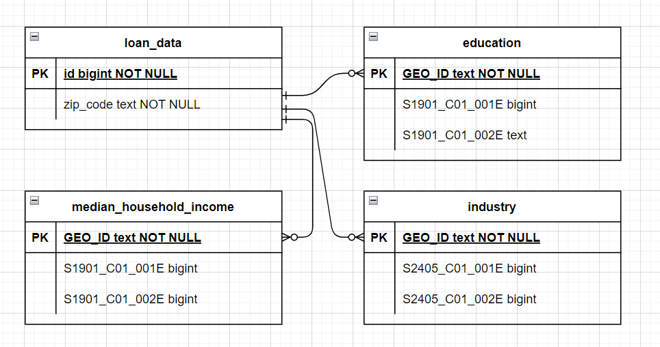

Please be noted that both loan data and census data have way too many columns, so for aesthetic purpose, only a few sample columns are shown in the diagram below. The metadata can also be found in the respect folders in 

## Hypothesis statement

## Report

###  Week one 

#### Data cleaning and EDA
The intial data set consisted of 75 columns and 887379 rows. 
The initial step was to drop the columns with no values and check for relevant columns with null values.
the final clean data consisted of the 11 columns as shown in the fig below.

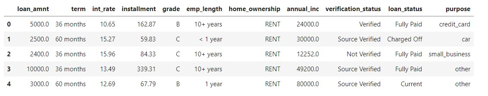

#### Data preprocessing
As suggested by the client, **"loan_status"** was made the label and the remaining columns was made into features.
Then all the features were encoded and teh follwing table was generated.

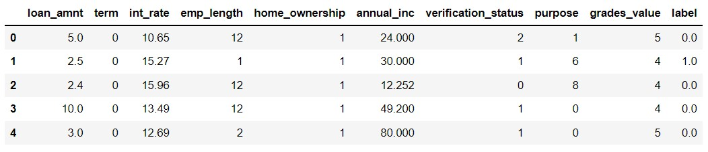

### Exploratory data anaysis
Pearson corellation was used to see the correlation between the features to the label and the one with the highest corelation factor were decided to be made into features.

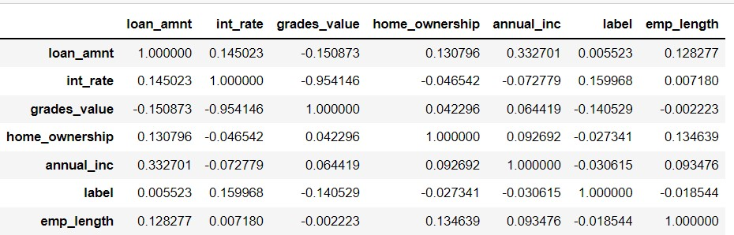

Following columns were decided to be used for features : loan_amnt,	int_rate,	grades_value,	home_ownership,	annual_inc,	emp_length and label.

### Model descision
Two models were decided were decided and precision was made to be the priority to judge the model i.e. RANDOM FOREST and KNN MODEL were finalised.

## Random forest
Compare two new Machine Learning models that reduce bias to predict credit risk. The models classified 51,366 as High Risk and 246 as Low Risk.
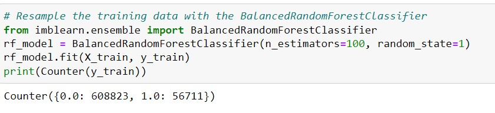

Balancedcount

BalancedRandomForestClassifier Model, two trees of the same size and equal size to the minority class are constructed to represent one for the majority class and one for the minority class.

The balanced accuracy score increased to 64.6 % for this model.

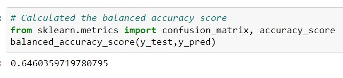

The "Low Risk precision rate came to 0.95 with the recall at 0.64  giving this model an F1 score of  0.77. "High Risk" only had a precision rate of 15% with the recall at 65%. 

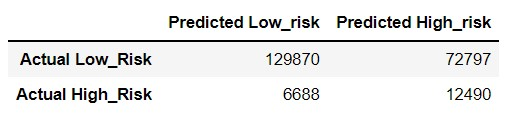

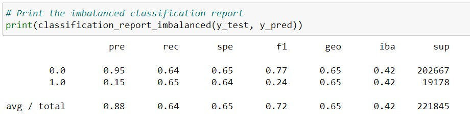

## Ensemble classifier

EasyEnsembleClassifier Model, a set of classifiers where individual decisions are combined to classify new examples.

The balanced accuracy score increased to 64.6% with this model.

The "Low Risk precision rate increased to 95% with the recall at 64.6% giving this model an F1 score of 77.7%. "high Risk" still had a precision rate of 100% with the recall now at 65%.

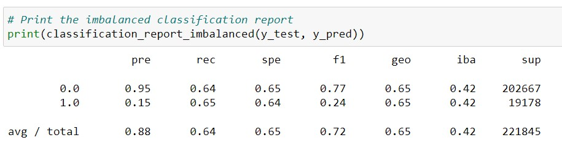
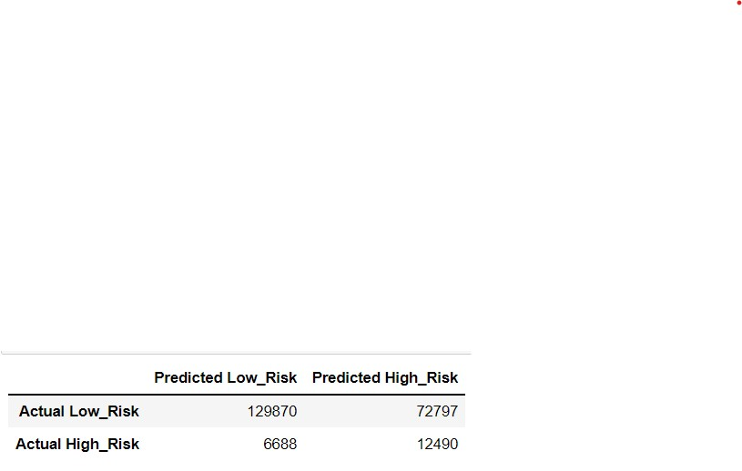

## Shortcoming of Week 1
low precision and low accuracy in both the models of random forest.

### Week two

KNN model was used to evaluate the model.
Initially it was assumed that the dataset was balanced and the KNN Model was used on the data set with the following results.
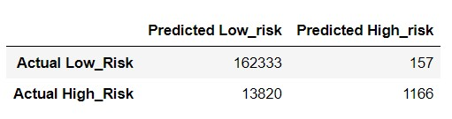

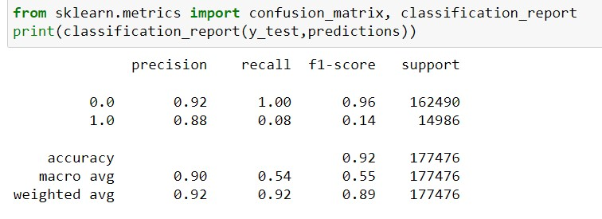

Due to the dataset being imbalanced, random oversampling was used to balance the dataset.

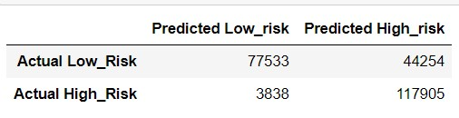

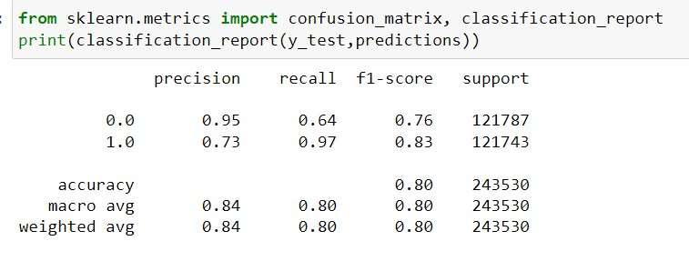

### Shortcomings in Week 2
Possiblity of overfitting of data needs to be evaluated.

Google Slides presentation: https://docs.google.com/presentation/d/1RJUA9Z22VSU07C9NauIzTvf_5KOHWlUEm0I5xhRp-LE/edit?usp=sharing
